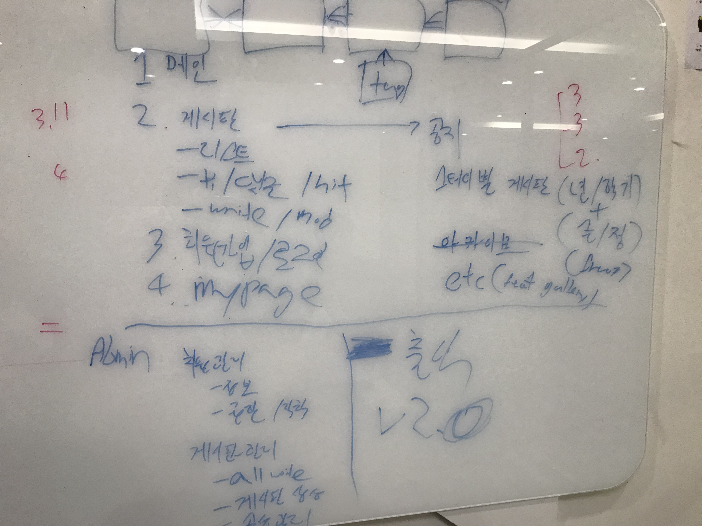

# 회의록

## 2018.10.04

### 사용할 기술 스택 조사

 - 웹서버 - Nginx로 결정
 - Node.js 프레임워크 - [hoi-hoon]
     - [Express](https://expressjs.com/ko/)
     - [Koa](https://koajs.com/)
     - [Hapi](https://hapijs.com/)
     - [Nest](http://nestjs.com/)
     - [Ect...](http://nodeframework.com/)
 - DB, Node DB library - [upla]
     - Mysql
     - MariaDB
     - PostgreSQL
     - MongoDB
     ---
     - [mysql](https://www.npmjs.com/package/mysql)
     - [Sequelize](https://www.npmjs.com/package/sequelize)
     - [Bookshelf](https://www.npmjs.com/package/bookshelf)
     - [TypeORM](https://www.npmjs.com/package/typeorm)
 - 프론트 앤드 프레임웍 - [bjh970913]
    - [Angular 6+](https://angular.io/)
    - [Vue.js](https://vuejs.org/)
    - [React](https://reactjs.org/)

## 2018.10.02

 - 디자인은 민근이가
 - 프론트엔드 프레임워크 vue문서로 결정
 - 백엔드는 node.js로 한정해서
    
    http 프레임워크
    
    model 프레임워크
    
    DBMS 결정

    서버 결정

 - 이슈 트래킹은 깃헙으로
 - 적용 할만한 외부 API 찾아보기
 
### 기술명세

1. 유저
2. ROLE 기반 security
3. 파일 업로드
4. 게시판 기능
5. 스터디 관리
6. 스터디 관련 자료 업로드
7. 진행중인 스터디에 연동된 게시판의 Write 권한 통제
8. 스터디 관련 게시판의 Read 권한 통제

### 사이트 기능

#### 일반 사용자

1. 메인 화면
    1. 게시판 모아보기
    2. 공지사항
    3. 네비게이션
2. 게시판
    1. 글 리스트
        1. 공지사항
        2. 스터디별 게시판
            - (준/정 회원) X (년도 / 학기) X (활성화 / 아카이브)
        3. 사진 갤러리
    2. 글 보기 / 댓글 / 좋아요
    3. 글 작성 / 수정
    4. 마이페이지
        1. 비밀번호 변경
3. 회원가입 / 로그인
4. 마이페이지

#### 관리자

1. 회원관리
    1. 정보관리
    2. 권한 / 역할 설정
2. 게시판 관리
    0. 모든 게시물에 대한 write 권한 부여
    1. 게시판 생성
    2. 게시판 속성 관리
3. ~~출석~~

[hoi-hoon]: http://github.com/hoi-hoon
[upla]: http://github.com/upla
[bjh970913]: http://github.com/bjh970913
[baemingun]: baemingun
